# Jarkom-Modul-4-D16-2023

**Praktikum Jaringan Komputer Modul 4 Tahun 2023**

## Author

| Nama                  | NRP        | 
| --------------------- | ---------- | 
| Dicky Indra Kuncahyo| 5025201250|
| Widian Sasi Disertasiani | 5025211024| 

# Laporan Resmi

## Topologi

## VLSM - GNS

## CIDR - CISCO 
### Penggabungan

### Tree

### Table

### Setting Cisco
Contoh Setting pada Aura dan Frieren

Aura

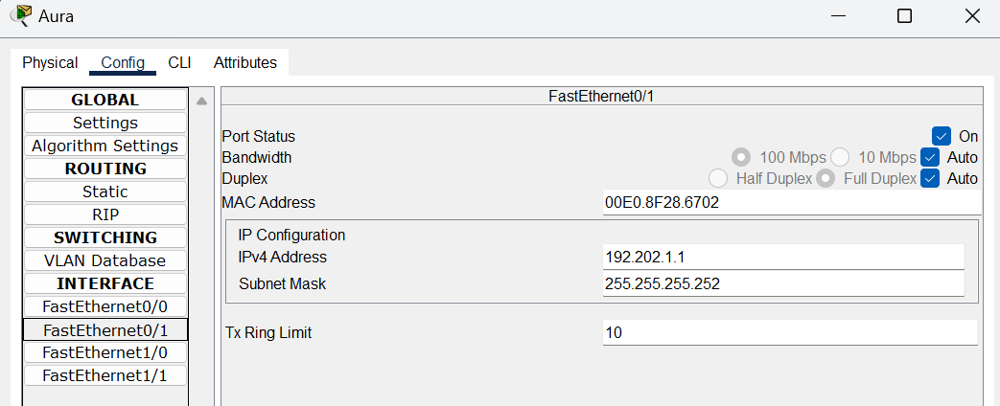
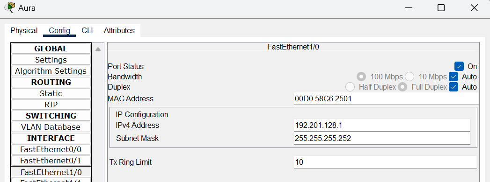
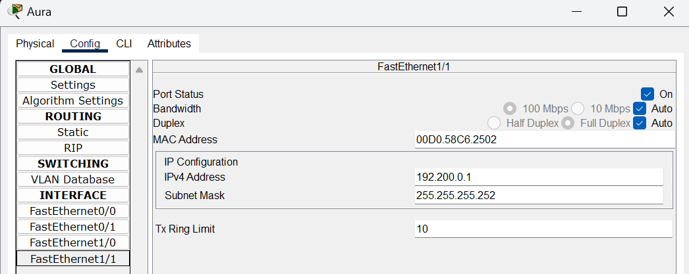
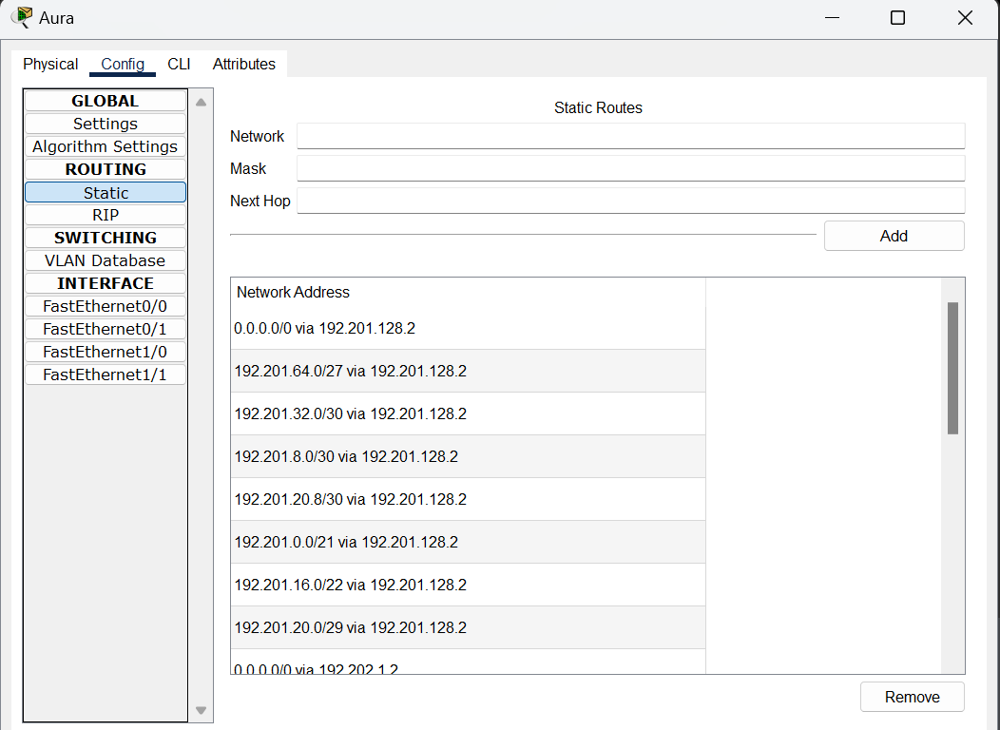
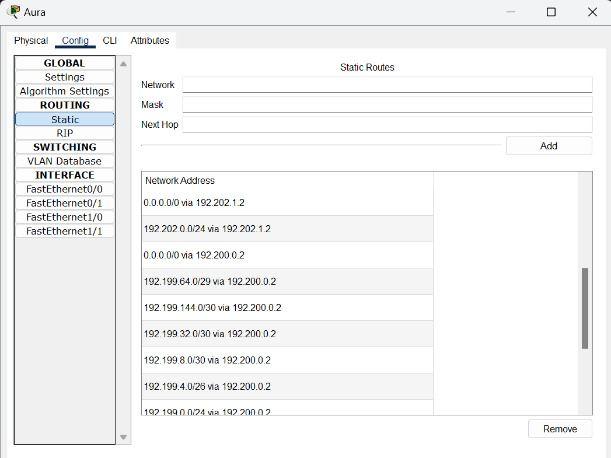
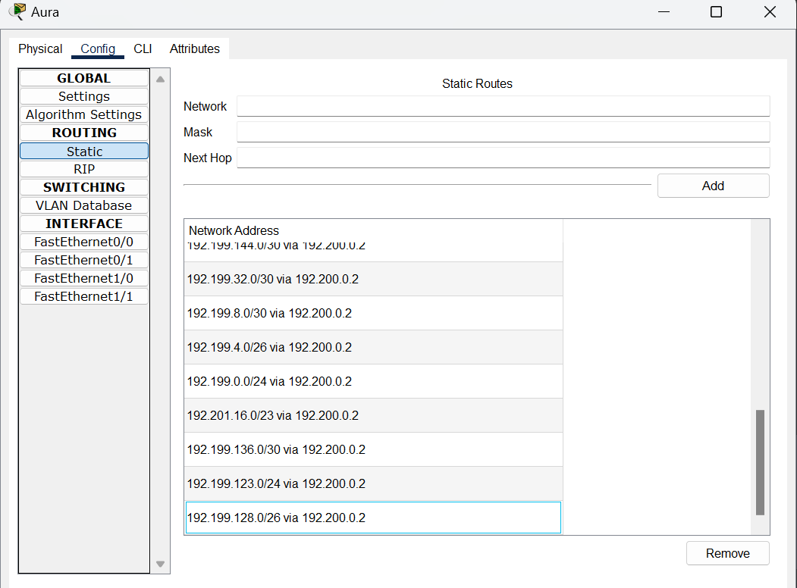

Frieren

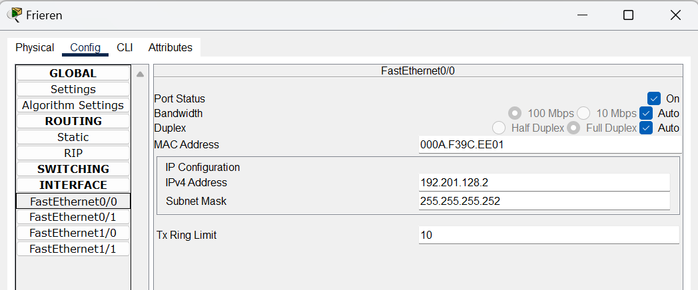
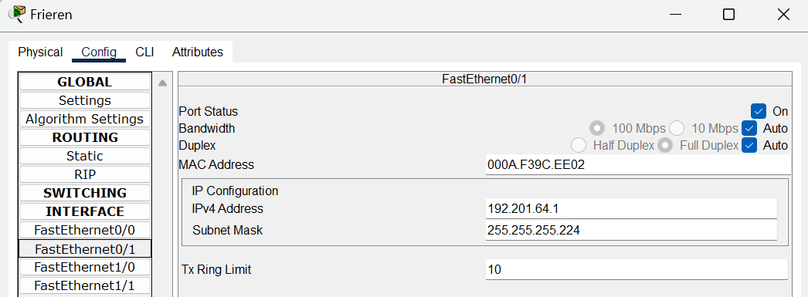
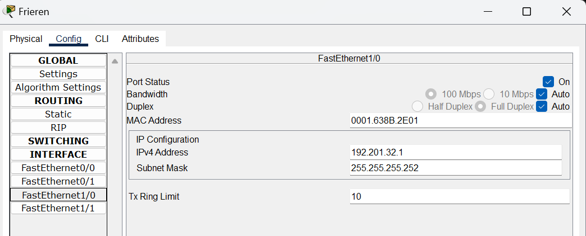
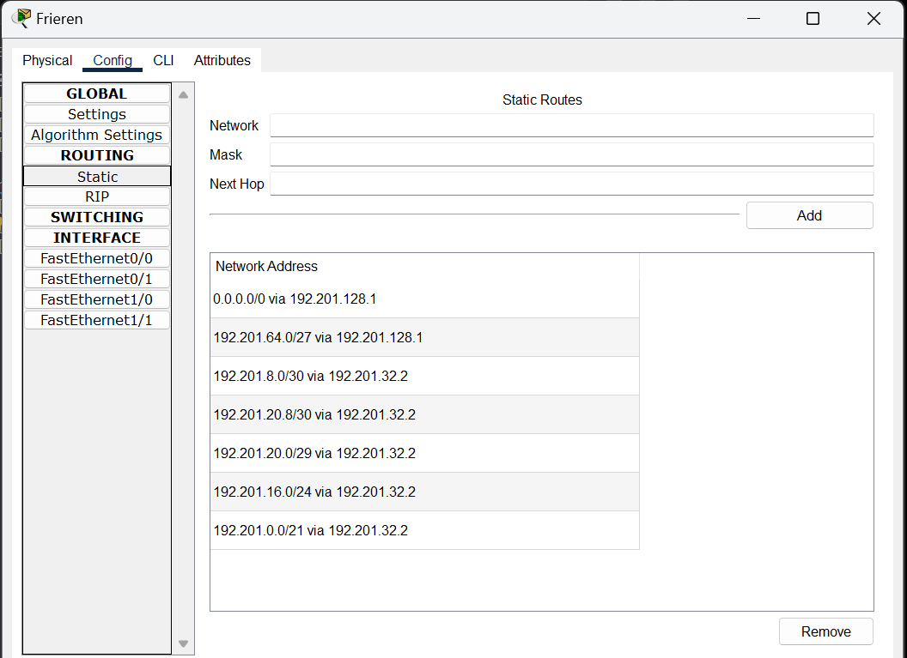

### Contoh apabila berhasil

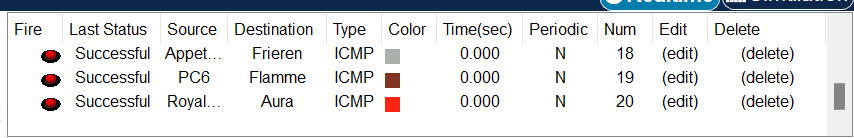