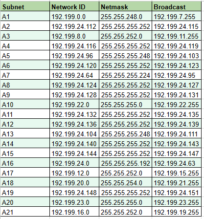

# Jarkom-Modul-4-D16-2023

**Praktikum Jaringan Komputer Modul 4 Tahun 2023**

## Author

| Nama                  | NRP        | 
| --------------------- | ---------- | 
| Dicky Indra Kuncahyo| 5025201250|
| Widian Sasi Disertasiani | 5025211024| 

# Laporan Resmi

## Topologi


## VLSM - GNS
### Tree


### Tabel



### Config

#### >Aura

```
auto eth0
iface eth0 inet dhcp

auto eth1
iface eth1 inet static
	address 192.199.24.129
	netmask 255.255.255.252

auto eth2
iface eth2 inet static
	address 192.199.24.129
	netmask 255.255.255.252

auto eth3
iface eth3 inet static
	address 192.199.24.133
	netmask 255.255.255.252
```

#### >Frieren

```
auto eth0
iface eth0 inet static
	address 192.199.24.130
	netmask 255.255.255.252
	gateway 192.199.24.129

auto eth1
iface eth1 inet static
	address 192.199.24.125
	netmask 255.255.255.252
```


#### >Flamme

```
#A6

auto eth0
iface eth0 inet static
	address 192.199.24.126
	netmask 255.255.255.252
	gateway 192.199.24.125

#A3

auto eth1
iface eth1 inet static
	address 192.199.8.1
	netmask 255.255.252.0

auto eth2
iface eth2 inet static
	address 192.199.24.113
	netmask 255.255.255.252


auto eth2
iface eth2 inet static
	address 192.199.24.117
	netmask 255.255.255.252
```

#### >Fern

```
#A2
auto eth0
iface eth0 inet static
address 192.199.24.114
netmask 255.255.255.252
gateway 192.199.24.113

#A1
auto eth1
iface eth1 inet static
address 192.199.0.1
netmask 255.255.248.0
```


#### >LaubHills

```
auto eth0
iface eth0 inet static
address 192.199.0.5
netmask 255.255.248.0
gateway 192.199.0.1
```

#### >ApetiteRegion

```
auto eth0
iface eth0 inet static
address 192.199.0.55
netmask 255.255.248.0
gateway 192.199.0.1
```

#### >RohrRoad

```
auto eth0
iface eth0 inet static
	address 192.199.9.0
	netmask 255.255.252.0
	gateway 192.199.8.1
```

#### >Himmel

```
#A4

auto eth0
iface eth0 inet static
	address 192.199.24.118
	netmask 255.255.255.252
	gateway 192.199.24.117

#A5

auto eth1
iface eth1 inet static
	address 192.199.24.97
	netmask 255.255.255.248
```

#### >SchewerMountains

```
#A5

auto eth0
iface eth0 inet static
	address 192.199.24.100
	netmask 255.255.255.248
	gateway 192.199.24.97
```

#### >Denken

```
auto eth0
iface eth0 inet static
	address 192.199.24.130
	netmask 255.255.255.252
	gateway 192.199.24.129

auto eth1
iface eth1 inet static
	address 192.199.22.1
	netmask 255.255.255.0
```

#### >RoyalCapital
```
auto eth0
iface eth0 inet static
	address 192.199.24.25
	netmask 255.255.255.0
	gateway 192.199.24.1
```

#### >WilleRegion

```
auto eth0
iface eth0 inet static
	address 192.199.24.50
	netmask 255.255.255.0
	gateway 192.199.24.1
```

#### >Eisen

```
auto eth0
iface eth0 inet static
address 192.199.132
netmask 255.255.255.252
gateway 192.199.24.133

auto eth1
iface eth1 inet static
address 192.199.24.137
netmask 255.255.255.252

auto eth2
iface eth2 inet static
address 192.199.24.149
netmask 255.255.255.252

auto eth3
iface eth3 inet static
address 192.199.24.105
netmask 255.255.255.248
```

#### >Richter

```
auto eth0
iface eth0 inet static
address 192.199.107
netmask 255.255.255.248
gateway 192.199.24.105
```

#### >Revolte

```
auto eth0
iface eth0 inet static
address 192.199.109
netmask 255.255.255.248
gateway 192.199.24.105

```

#### >Stark

```
auto eth0
iface eth0 inet static
address 192.199.138
netmask 255.255.255.252
gateway 192.199.24.137
```


#### >Lugner

```
auto eth0
iface eth0 inet static
address 192.199.150
netmask 255.255.255.252
gateway 192.199.24.149

auto eth1
iface eth1 inet static
address 192.199.16.1
netmask 255.255.252.0

auto eth2
iface eth2 inet static
address 192.199.23.1
netmask 255.255.255.0
```

#### >TurkRegion

```
#A21

auto eth0
iface eth0 inet static
address 192.199.16.50
netmask 255.255.255.0
gateway 192.199.16.1
```

#### >GrobeForest

```
#A20

auto eth0
iface eth0 inet static
address 192.199.23.100
netmask 255.255.255.0
gateway 192.199.23.1
```

#### >Linie

```
auto eth0
iface eth0 inet static
address 192.199.24.106
netmask 255.255.255.252
gateway 192.199.24.105

auto eth1
iface eth1 inet static
address 192.199.20.1
netmask 255.255.254.0

auto eth2
iface eth2 inet static
address 192.199.24.145
netmask 255.255.255.252
```

#### >GranzChannel

```
#A18


auto eth0
iface eth0 inet static
address 192.199.20.50
netmask 255.255.254.0
gateway 192.199.20.1
```

#### >Lawine

```
auto eth0
iface eth0 inet static
address 192.199.24.146
netmask 255.255.255.252
gateway 192.199.24.145

auto eth1
iface eth1 inet static
address 192.199.24.1
netmask 255.255.255.192
```

#### >BredtRegion

```
auto eth0
iface eth0 inet static
address 192.199.24.10
netmask 255.255.255.192
gateway 192.199.24.1
```

#### >Heiter

```
auto eth0
iface eth0 inet static
address 192.199.24.10
netmask 255.255.255.192
gateway 192.199.24.1

auto eth1
iface eth1 inet static
address 192.199.12.1
netmask 255.255.252.0
```

#### >Sein

```
auto eth0
iface eth0 inet static
address 192.199.13.0
netmask 255.255.252.0
gateway 192.199.12.1
```

#### >RiegelCanyon

```
auto eth0
iface eth0 inet static
address 192.199.14.0
netmask 255.255.252.0
gateway 192.199.12.1
```


## CIDR - CISCO 
### Penggabungan


### Tree


### Table


### Setting Cisco
Contoh Setting pada Aura dan Frieren


Aura


Frieren


### Contoh apabila berhasil


